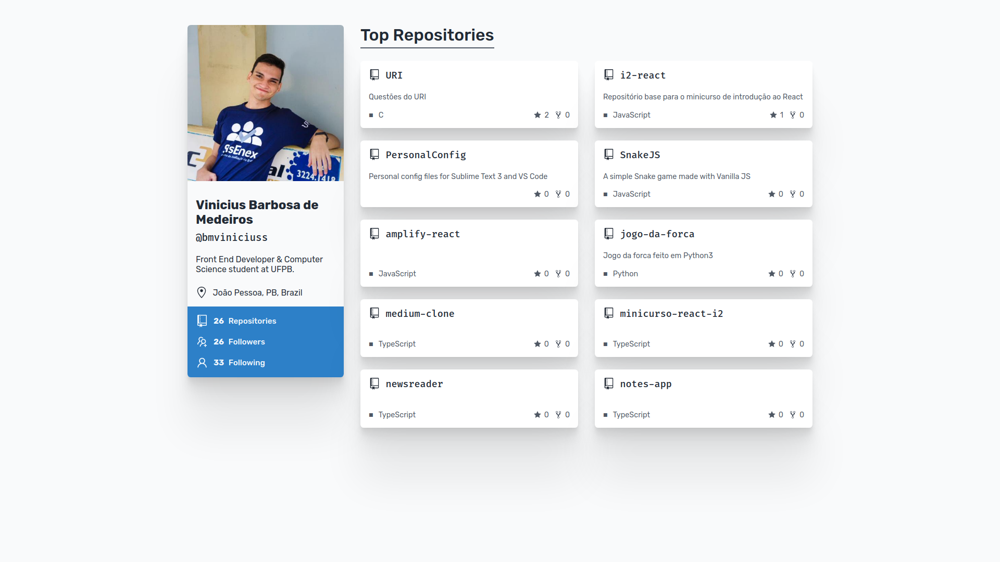

# OctoLens - Github Profile Visualizer

</img>

[Live Demo](https://romantic-edison-cd660a.netlify.com/)

Built with:

- [Typescript](https://www.typescriptlang.org/)
- [React](https://reactjs.org/)
- [Styled Components](https://styled-components.com/)
- [Axios](https://github.com/axios/axios)

Tested with:

- [React Testing Library](https://testing-library.com/docs/react-testing-library/intro)

## Getting Started

1. Clone repo

```bash
git clone https://github.com/bmviniciuss/octolens
```

2. Open directory

```bash
cd octolens
```

3. Install dependencies

```bash
yarn
```

4. Run

```bash
yarn start
```
